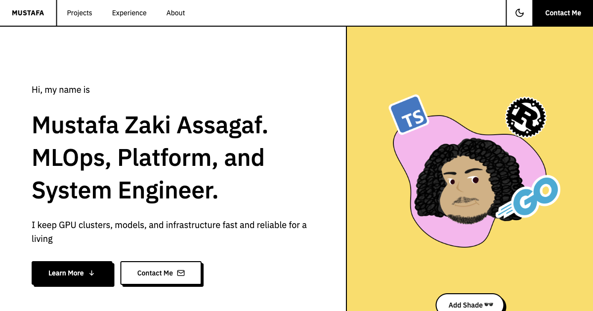

# mustafasegf.com

My personal website. Neobrutalist design straight from Figma, built to be light and fast.



## Stack

- [Astro](https://astro.build) with React islands, only the interactive parts ship JS
- [Tailwind CSS v4](https://tailwindcss.com) with a CSS-first theme
- [shadcn/ui](https://ui.shadcn.com) on Base UI
- Light mode by default with a persisted dark-mode toggle
- Respects `prefers-reduced-motion`

## Develop

```sh
cp .env.example .env   # fill in your links
bun install
bun run dev
```

## Build

```sh
bun run build          # static site in dist/
bun run serve          # serve dist/ with Bun
```

## Docker via Nix

```sh
nix build .#dockerImage
docker load < result
docker run -p 3000:3000 personal-web:latest
```
